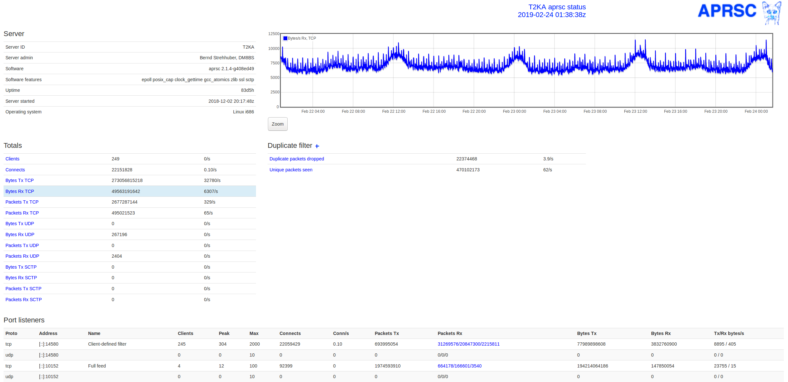

# APRSC K8s

A Kuberneties-ified version of [hessu's aprsc](http://aprs-is.net/) APRS-IS server. [APRS-IS](http://aprs-is.net/) connects regional APRS packet radio networks together through the Internet. The original source for `aprsc` lives [here](https://github.com/hessu/aprsc).



## Install

```bash
# clone the repo
git clone https://github.com/brannondorsey/aprsc-docker
cd aprsc-docker
```

```bash
# Edit the aprsc.conf ConfigMap. You MUST configure this to fit
# your needs. Configuration information is available here:
#  http://he.fi/aprsc/CONFIGURATION.html
$EDITOR k8s.yaml
```

```bash
# apply the k8s.yaml manifest containing a deployment, a load balancer service,
# and a config map.
kubectl apply --namespace aprsc -f k8s.yaml
```

You should now have an HTTP status server running on your load balancer at port 14501.
